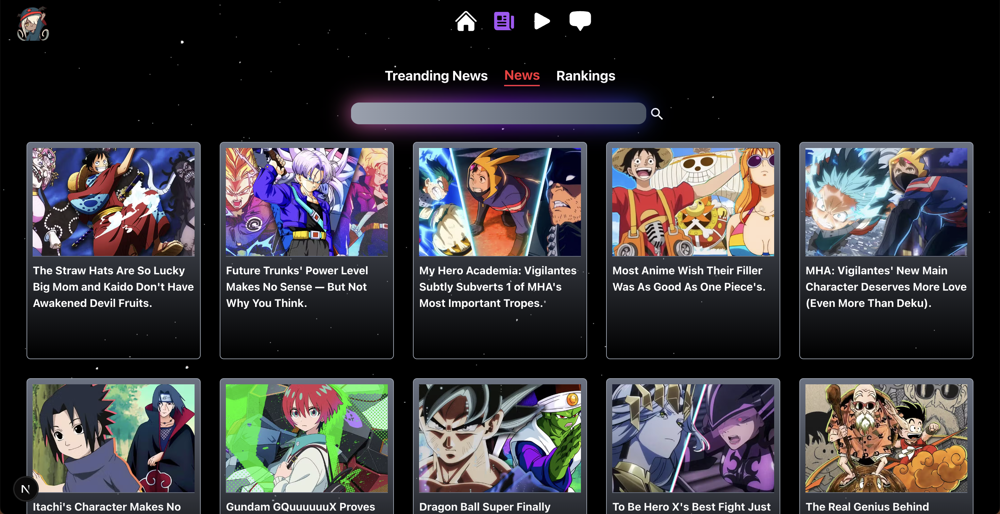
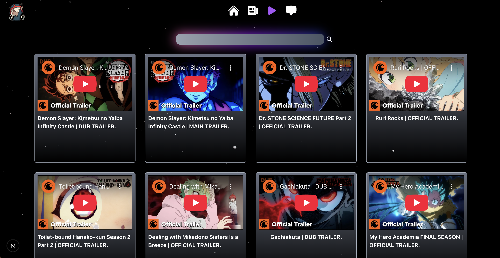

# Senpai Central

Senpai Central is a modern web application for anime and manga fans. It brings you trending news, anime rankings, the latest anime trailers, and more—all in one place. The project is built with [Next.js](https://nextjs.org) for the frontend and uses custom Python scrapers for fetching the latest content.

---

## ⚠️ Usage Notice

**Please use or deploy this project only after obtaining permission from the repository owner.**

---

## Features

- **Trending Anime News:**  
  Stay updated with the latest and most popular news from the anime world.

- **Anime Rankings:**  
  Discover top-ranked anime series and movies, updated regularly.

- **Latest Anime Trailers:**  
  Watch the newest trailers for upcoming and ongoing anime, fetched directly from official sources.

- **Full Article Scraping:**  
  Read complete articles directly within the app, thanks to integrated backend scrapers.

- **Modern UI:**  
  Enjoy a clean, responsive, and user-friendly interface.

---

## Screenshots

### Home Page


### News



### Trailers



---

## Getting Started

### 1. Clone the Repository

```bash
git clone https://github.com/Ankit-Mishra0/Senpai-Central.git
cd Senpai-Central
```

### 2. Set Up Python Virtual Environment (for scrapers)

```bash
python3 -m venv .venv
source .venv/bin/activate
pip install -r requirements.txt
```

### 3. Install Node.js Dependencies

```bash
npm install
# or
yarn install
```

### 4. Run the Development Server

```bash
npm run dev
# or
yarn dev
```

Open [http://localhost:3000](http://localhost:3000) in your browser to see the app.

---

## Project Structure

- `app/` — Next.js frontend code
- `i-central/app/scrapper/` — Python scrapers for news and articles
- `app/YT_API/` — Python scripts for fetching anime trailers from YouTube
- `requirements.txt` — Python dependencies
- `README.md` — Project documentation

---

## Contributing

Pull requests and issues are welcome!  
Feel free to suggest features or report bugs.

---

## License

MIT License

---
