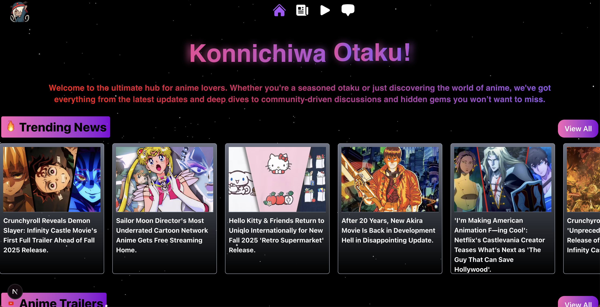
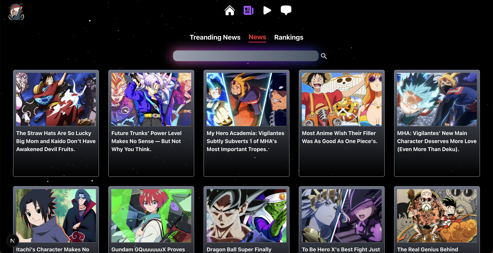
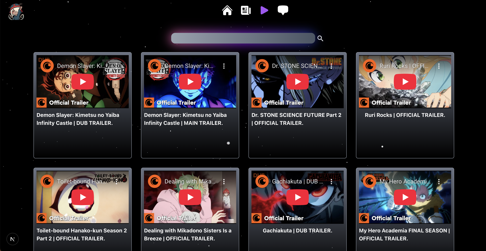

# Senpai Central

[🔗 Live Demo → https://senpai-central.vercel.app](https://senpai-central.vercel.app)

Senpai Central is a modern web application for anime and manga fans. It brings you trending news, anime rankings, the latest anime trailers, and more — all in one place.

> 🚀 **Deployed With:**
>
> - **Frontend:** [Vercel](https://vercel.com)
> - **Backend (Scraper API):** [Render](https://render.com)
> - **Database:** [Neon](https://neon.tech) (PostgreSQL)

---

## ⚠️ Usage Notice

**Please use or deploy this project only after obtaining permission from the repository owner.**

---

## Features

- **Trending Anime News:**  
  Stay updated with the latest and most popular news from the anime world.

- **Anime Rankings:**  
  Discover top-ranked anime series and movies, updated regularly.

- **Latest Anime Trailers:**  
  Watch the newest trailers for upcoming and ongoing anime, fetched directly from official sources.

- **Full Article Scraping:**  
  Read complete articles directly within the app, thanks to integrated backend scrapers.

- **Modern UI:**  
  Enjoy a clean, responsive, and user-friendly interface.

---

## Screenshots

### Home Page



### News



### Trailers



---

## Getting Started

### 1. Clone the Repository

```bash
git clone https://github.com/Ankit-Mishra0/Senpai-Central.git
cd Senpai-Central
```

### 2. Set Up Python Virtual Environment (for scrapers)

```bash
python3 -m venv .venv
source .venv/bin/activate
pip install -r requirements.txt
```

### 3. Install Node.js Dependencies

```bash
npm install
# or
yarn install
```

### 4. Run the Development Server

```bash
npm run dev
# or
yarn dev
```

Open [http://localhost:3000](http://localhost:3000) in your browser to see the app.

### 5. Configure Environment Variables

Copy `.env.example` to `.env` in the project root and fill in the values for your local services. For the AI assistant, create a key at [Google AI Studio](https://aistudio.google.com/app/apikey) and set:

```env
GEMINI_API_KEY=your_gemini_api_key_here
GEMINI_MODEL=gemini-2.5-flash
```

`GEMINI_API_KEY` is read only by the server route at `/api/chat`; do not prefix it with `NEXT_PUBLIC_` or expose it in client-side code. Add the same variables under your Vercel project's Environment Variables for a deployment, then redeploy.

---

## Project Structure

- `app/` — Next.js frontend code
- `app/scrapper/` — Python scrapers for news and articles
- `app/YT_API/` — Python scripts for fetching anime trailers from YouTube
- `requirements.txt` — Python dependencies
- `README.md` — Project documentation

---

## Contributing

Pull requests and issues are welcome!  
Feel free to suggest features or report bugs.

---

## License

MIT License

---
